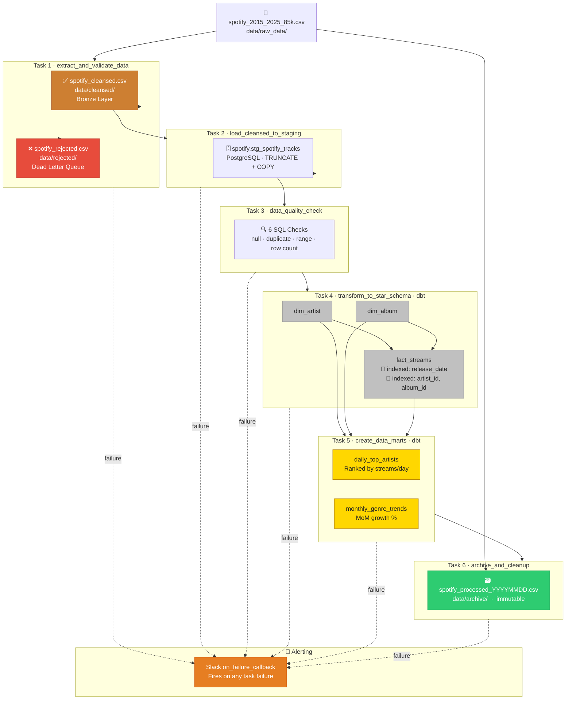

# Spotify ETL — Data Architecture (Senior DE Perspective)

## 1. Overview



---

## 2. Layered Data Model

| Layer | Folder / Schema | Materialization | Owner | Purpose |
|-------|----------------|-----------------|-------|---------|
| **Landing** | `data/raw_data/` | CSV file | Ops / upstream | Raw drop zone — untouched |
| **Rejected** | `data/rejected/` | CSV file | Data Engineer | Bad rows + error_reason for replay |
| **Bronze** | `data/cleansed/` | CSV file | Data Engineer | Validated, typed, no transforms yet |
| **Staging** | `spotify.stg_*` | PostgreSQL table (TRUNCATE+LOAD) | Data Engineer | Bulk load buffer — full refresh each run |
| **Silver** | `spotify.dim_*`, `spotify.fact_*` | dbt table | Data Engineer | Star schema — reusable by any consumer |
| **Gold** | `spotify_marts.*` | dbt table | Analytics Engineer | Pre-aggregated, DA-ready |

---

## 3. Star Schema Design

### fact_streams — Grain: 1 row per (track_id, country)

```
fact_streams
├── stream_id        PK (surrogate: MD5 of track_id + country)
├── track_id         NK (natural key from source)
├── artist_id        FK → dim_artist
├── album_id         FK → dim_album
├── release_date     PARTITION KEY  ◄── filter by date range efficiently
├── country
├── genre
├── stream_count     MEASURE
├── popularity       MEASURE
├── duration_ms      MEASURE
├── danceability     MEASURE (audio feature)
├── energy           MEASURE (audio feature)
├── tempo            MEASURE (audio feature)
└── loaded_at
```

### dim_artist

```
dim_artist
├── artist_id    PK (surrogate)
├── artist_name  NK
└── updated_at
```

### dim_album

```
dim_album
├── album_id     PK (surrogate)
├── artist_id    FK → dim_artist
├── album_name   NK
├── label
├── genre
├── release_date
└── updated_at
```

---

## 4. Idempotency & Reliability Design

### Why this matters
Re-running the pipeline on the same date must produce identical results — no duplicates, no data loss.

| Task | Idempotency guarantee |
|------|----------------------|
| Extract | Reads same source file → same output (deterministic) |
| Load to Staging | `TRUNCATE + COPY` — full refresh, always consistent |
| dbt dimensions | `unique_key` config → INSERT OR REPLACE on conflict |
| dbt facts | `unique_key=['track_id','country']` → upsert |
| Archive | Move + rename with run date → safe to re-check with `if exists` |

---

## 5. Data Quality Gates

```
Gate 1 (Python / Task 1)       Gate 2 (SQL / Task 3)
──────────────────────         ─────────────────────────
• track_id not null            • null track_ids = 0
• duration_ms > 0              • duplicate track_ids = 0
• popularity 0–100             • invalid duration = 0
• danceability 0.0–1.0         • invalid popularity = 0
• energy 0.0–1.0               • invalid danceability = 0
• stream_count >= 0            • row count == Task 1 valid count ◄── cross-task assertion
```

**Rule**: Gate 2 cross-task row count check catches any silent drops between CSV → PostgreSQL (encoding issues, COPY errors).

---

## 6. Error Handling Strategy

```
                    ┌─── valid ──► cleansed.csv ──► Staging ──► Star Schema
source.csv ──────►  │
                    └─── invalid ► rejected.csv (with error_reason + timestamp)
                                       │
                                       └── Manual review → fix → re-drop to Landing
                                                                  (replay pattern)
```

**DLQ (Dead Letter Queue) principle**: rejected rows are never silently dropped — they're preserved with context for replay. The pipeline operator reviews `data/rejected/` after each run.

---

## 7. Alerting & Observability

| Signal | Mechanism | Action |
|--------|-----------|--------|
| Any task failure | Slack `on_failure_callback` | Immediate alert with task name + log URL |
| DLQ has rows | Logged as WARNING in Task 1 | Review `data/rejected/` before next run |
| DQ gate fails | Task 3 raises `ValueError` | Pipeline halts — no bad data reaches Star Schema |
| dbt model failure | BashOperator non-zero exit | Triggers Slack alert via Airflow |

---

## 8. Scalability Roadmap (Next Steps)

### Short-term (current architecture handles ~85k rows fine)
- [ ] Add `dbt test` step after `dbt run` (schema + uniqueness tests)
- [ ] Parameterize source file via Airflow Variable (support multiple drop files)
- [ ] Add `airflow-init` container to `docker-compose.yml` for clean DB migration

### Medium-term (>1M rows / multi-source)
- [ ] Replace CSV drop with S3 / GCS landing zone + event trigger
- [ ] Replace `COPY` with `pg_bulkload` or switch to BigQuery for columnar performance
- [ ] Add `dim_date` table for proper date spine joins
- [ ] Switch dbt materialization for `fact_streams` to **incremental** (append-only by `release_date`)

### Long-term (real-time / streaming)
- [ ] Replace batch ingest with Kafka → Flink → PostgreSQL (CDC pattern)
- [ ] Migrate Gold layer to BigQuery with native `PARTITION BY DATE(release_date)` + `CLUSTER BY artist_name, album_id`
- [ ] Add data lineage tracking (OpenLineage / Marquez)

---

## 9. Project Directory Structure

```
ETL_SPOTIFY/
├── dags/
│   └── spotify_etl_dag.py          ← Airflow DAG (all 6 tasks)
├── data/
│   ├── raw_data/                   ← Drop zone (source CSV here)
│   ├── cleansed/                   ← Bronze (valid rows, temp)
│   ├── rejected/                   ← DLQ (invalid rows, kept)
│   ├── archive/                    ← Processed files (immutable)
│   └── staging/                    ← (reserved for flat-file staging)
├── scripts/
│   ├── entrypoint.sh               ← Docker init: db migrate + user create
│   └── requirements.txt            ← Python deps for Airflow container
├── dbt_spotify/
│   ├── dbt_project.yml
│   ├── profiles.yml
│   └── models/
│       ├── staging/
│       │   └── stg_spotify_tracks.sql
│       ├── dimensions/
│       │   ├── dim_artist.sql
│       │   └── dim_album.sql
│       ├── facts/
│       │   └── fact_streams.sql
│       └── marts/
│           ├── daily_top_artists.sql
│           └── monthly_genre_trends.sql
├── plugins/                        ← Airflow custom operators (empty for now)
└── docker-compose.yml
```

---

## 10. How to Run

```bash
# 1. Start the stack
docker-compose up -d

# 2. Wait ~60 sec for init to complete, then open Airflow UI
open http://localhost:8080
# Login: admin / admin

# 3. Drop source file
cp /path/to/spotify_2015_2025_85k.csv data/raw_data/

# 4. Trigger DAG manually (or wait for 02:00 UTC schedule)
# Airflow UI → DAGs → spotify_daily_etl_pipeline → Trigger

# 5. Check results
psql -h localhost -U airflow -d airflow -c "SELECT COUNT(*) FROM spotify.fact_streams;"
```
